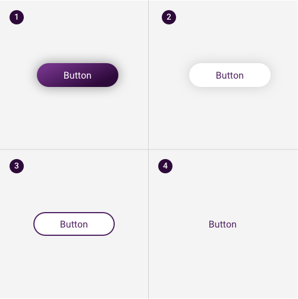

# Button

## Principles

* **Identifiable**:  Buttons should indicate that they can trigger an action.
* **Findable**:  Buttons should be easy to find among other elements, including other buttons.
* **Clear**:  A button’s action and state should be clear.

## Usage

### Where

Buttons are typically placed throughout your UI, in places like:

* Dialogs
* Modal windows
* Forms
* Cards
* Toolbars

### When

Buttons should be used in situations where users might need to:

* Submit a form
* Begin a new task
* Trigger a new UI element to appear on the page
* Specify a new or next step in a process

### Button vs Link

* Use a **link** when you’re **navigating to another place**, such as: a "view all" page, "Anne James" profile, a page "skip link" etc.
* Use **buttons** when you are **performing an action**, such as: "submit," "merge," "create new," "upload," etc.

## Types

#### **1. Gradient button** \(Primary button\)

To call attention to an action on a form, or highlight the strongest call to action on a page. Primary buttons should only appear once per area \(screen/ card/ form/ section/ modal...\). Not every area requires a primary button.

#### **2. White button** \(Secondary button\)

The standard button for most use cases. Or use with the Primary button for for actions that are less crucial such as “Cancel".

#### **3. Border button**

#### **4. Plan button**

\*\*\*\*

## Anatomy

